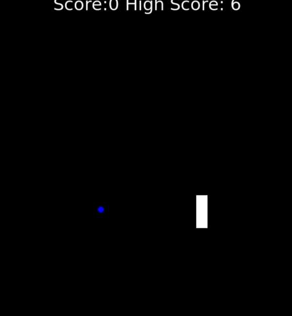

<h1 align="center"> 
Snake </h1>

 
  

The game involves controlling a single block or snakehead by turning only left or right by ninety degrees until you manage to eat a dot. When you get the dot, the Snake grows an extra block or body segment.
I used the Turtle graphical library using python to make this game.

